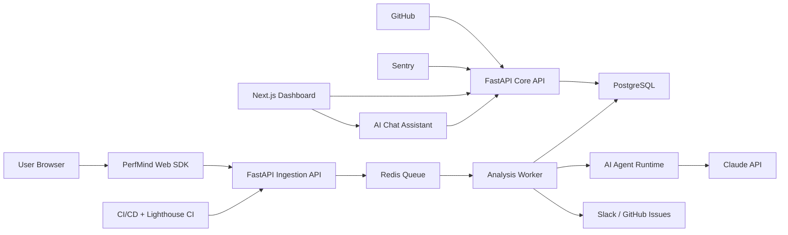
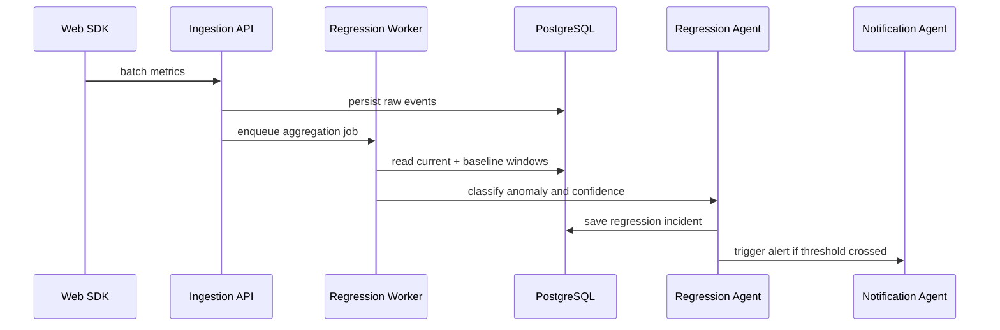

# PerfMind AI Architecture

## Product Goal

PerfMind AI is an autonomous frontend performance monitoring system. It collects real user monitoring data, release metadata, browser errors, API failures, and build artifacts, then uses agent workflows to detect regressions, explain likely causes, predict future risk, and recommend or generate fixes.

## System Overview



## Core Components

### 1. Performance Monitoring Layer

The browser SDK collects real user monitoring signals using:

- Web Vitals API for LCP, CLS, INP, FCP, and TTFB.
- `PerformanceObserver` for navigation, resource, long task, paint, layout shift, and event timing entries.
- Browser Performance API for resource timing, page lifecycle, memory where available, and custom marks.
- Global listeners for JavaScript runtime errors and unhandled promise rejections.
- Fetch/XHR wrappers for failed API requests and response timing.
- Optional animation loop sampling for FPS drops.

Data is batched, sampled, enriched with release/page/session/device/browser/region metadata, and sent to the ingestion API.

### 2. Backend API

FastAPI owns:

- Metric ingestion and validation.
- Query APIs for dashboard pages.
- Release and deployment correlation.
- Alert lifecycle management.
- Chat orchestration endpoints.
- GitHub, Slack, Sentry, Lighthouse CI, and OpenTelemetry integrations.

The API writes durable records to PostgreSQL and schedules background analysis jobs through Redis.

### 3. Worker Layer

Workers run asynchronous jobs:

- Aggregate raw metrics into time windows.
- Compare current and previous release baselines.
- Detect anomalies and regressions.
- Analyze root cause evidence.
- Predict PR and deployment performance risk.
- Generate optimization suggestions and patch plans.
- Send Slack alerts and create GitHub issues.

### 4. AI Agent Runtime

The agent layer is modular. LangGraph is the orchestration backbone, CrewAI-style role separation can be used for specialized agents, and Claude API powers reasoning and code-oriented recommendations.

Agents:

- Collector Agent: validates metric streams and schedules aggregation.
- Regression Agent: compares release/page/device/browser cohorts and flags anomalies.
- Root Cause Agent: correlates commits, deployments, components, assets, bundles, errors, and waterfalls.
- Prediction Agent: scores PRs and dependency changes before deploy.
- Optimization Agent: generates fix suggestions, code snippets, and patch proposals.
- Notification Agent: turns findings into Slack alerts, GitHub issues, or PR comments.

### 5. Data Storage

PostgreSQL stores durable product data:

- Projects, environments, releases, deployments.
- Pages, routes, components, assets, bundles.
- Raw metric events and aggregated metric windows.
- Regression incidents, root cause reports, predictions, suggestions, alerts.
- Chat threads and AI tool traces.

Redis is used for:

- Job queues.
- Short-lived cache.
- Rate limiting.
- Real-time dashboard fanout.

### 6. Observability

Monitoring stack:

- OpenTelemetry for traces, metrics, and logs across API and workers.
- Lighthouse CI for synthetic performance snapshots.
- Sentry for runtime exceptions, sourcemap context, and release association.
- Grafana-style dashboard panels inside the product UI.
- Health checks and alerting for ingestion lag, worker backlog, and agent failures.

## Regression Detection Flow



Example regression object:

```json
{
  "status": "regression_detected",
  "page": "Checkout",
  "metric": "lcp",
  "previous_value_ms": 2300,
  "current_value_ms": 4800,
  "severity": "high",
  "confidence": 0.94
}
```

## Root Cause Analysis Flow

The Root Cause Agent builds an evidence bundle:

- Release diff and deployment metadata.
- Git commits and changed files.
- Component ownership and route mapping.
- Bundle analyzer output.
- Resource waterfall deltas.
- JavaScript errors and failed API calls.
- Asset size changes.
- Layout shift attribution where available.

It returns ranked causes with confidence, supporting evidence, and fixes.

Example:

```json
{
  "issue": "CLS increased by 42%",
  "probable_cause": "Dynamic promotional banner inserted above checkout form without reserved height.",
  "confidence": 0.87,
  "suggested_fixes": [
    "Reserve banner height with CSS before content loads.",
    "Set image width and height attributes.",
    "Render a skeleton placeholder during banner fetch."
  ]
}
```

## Predictive Performance Flow

Before deployment, the Prediction Agent analyzes:

- PR changed files.
- Dependency changes.
- Bundle diff and chunk graph.
- Added assets and image dimensions.
- Route/component ownership.
- Lighthouse CI deltas.

It returns predicted impact:

```json
{
  "new_dependency": "chart.js",
  "bundle_increase_kb": 650,
  "predicted_lcp_delta_ms": 1100,
  "predicted_cls_delta": 0.01,
  "risk_level": "medium"
}
```

## Auto Optimization Flow

The Optimization Agent suggests or generates:

- Lazy loading for below-the-fold UI.
- Dynamic imports for expensive components.
- Image compression and responsive formats.
- Code splitting and route-level chunking.
- Memoization or rendering fixes.
- Unused dependency removal.
- Cache headers and CDN recommendations.
- Skeleton placeholders and reserved dimensions.

Patch generation is staged behind review gates. Optional GitHub PR creation should be explicit and auditable.

## Dashboard Pages

1. Overview: health index, performance score, active alerts, errors, and release status.
2. Metrics: LCP, CLS, INP, FCP, TTFB, FPS, memory, API failures, and resource timing.
3. Regression Timeline: incidents by release, page, metric, severity, and confidence.
4. Deployment Analysis: release comparisons, deploy health, commit correlation.
5. Root Cause Explorer: ranked evidence, waterfall changes, errors, and component diffs.
6. Prediction Center: PR risk scoring and pre-deploy impact forecasts.
7. AI Suggestions: optimization backlog, patch proposals, and accepted fixes.
8. Chat Assistant: natural-language investigation interface for engineers.

## Security And Reliability

- Project-scoped API keys for SDK ingestion.
- Signed webhook verification for GitHub, Slack, and Sentry.
- PII-safe event collection with configurable redaction.
- Rate limits per project/environment/release.
- Idempotent ingestion using event IDs.
- Dead-letter queue for failed analysis jobs.
- Human approval for generated patches and PRs.

